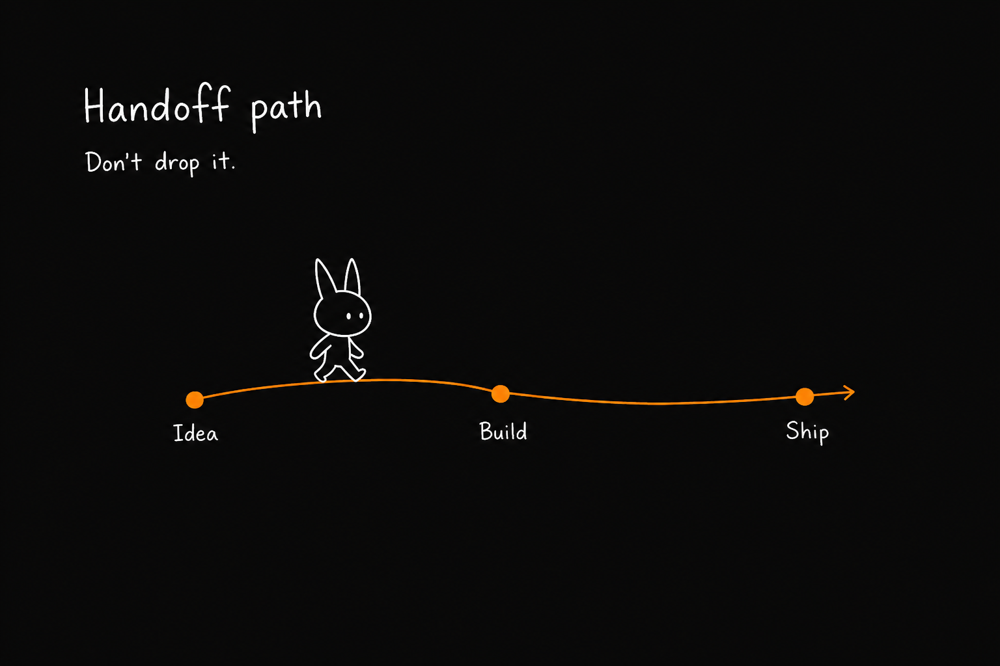
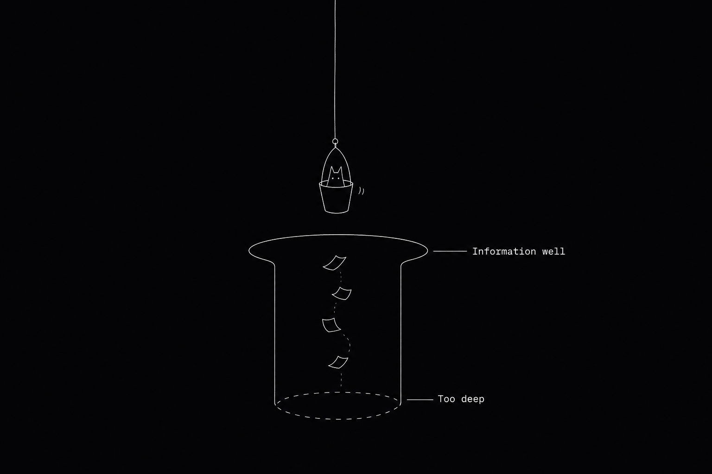
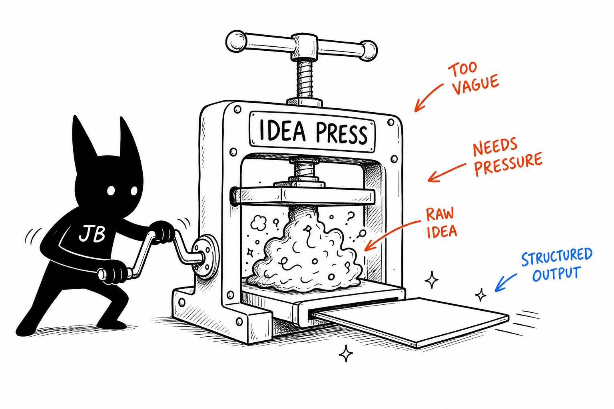
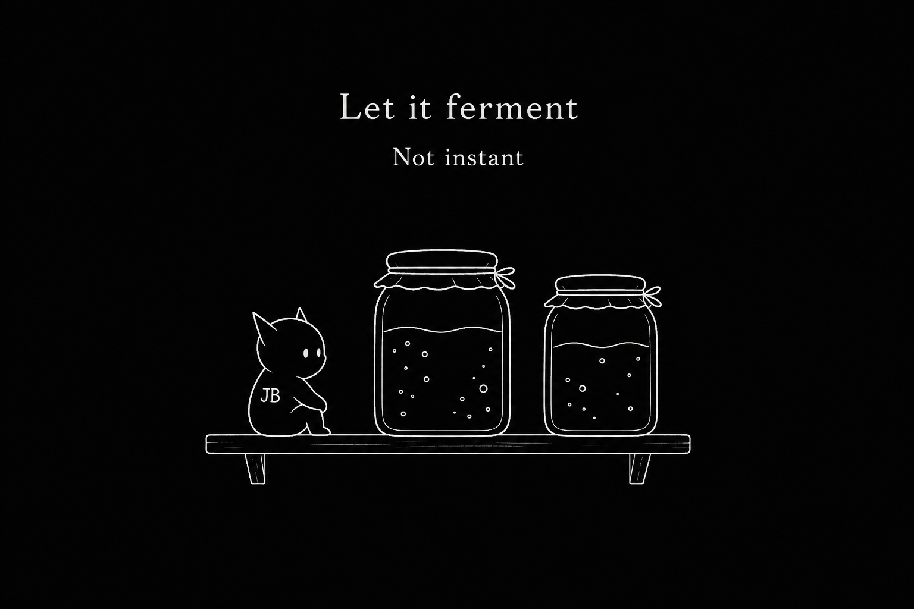
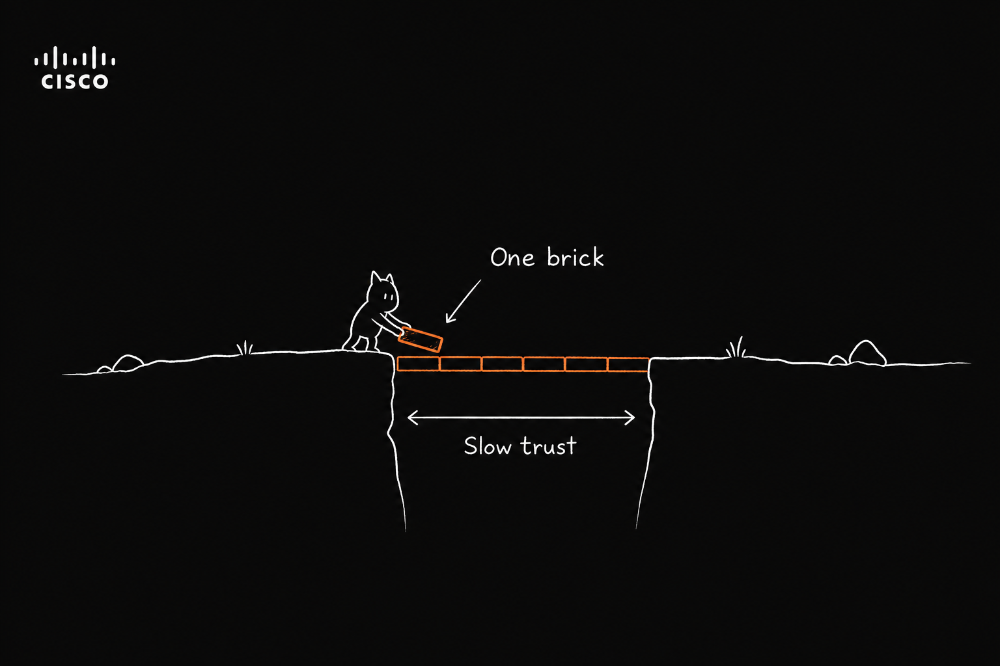

# JB Illustrations

> Turn judgments, flows, states, and metaphors in English articles into hand-drawn, absurd-but-clean inline illustrations.
>
> 16:9 landscape | JB IP | minimal Cisco dark case-study style | sparse English annotations | Agent Skill

---

## What This Repo Is

JB Illustrations is an Agent Skill that guides AI agents to generate inline illustrations for English articles, posts, blogs, Notion docs, and methodology content — with a **Cisco case-study lens**.

It is not a generic illustration prompt pack or a PPT infographic template. Its core goal: understand the cognitive anchor in an article, then turn one judgment, flow, structure, state, or metaphor into a memorable 16:9 hand-drawn explainer image.

The default visual IP is **JB**: a small solid-dark creature with white dot eyes, thin legs, and a blank expression. JB is not a mascot, not a sticker, and not decoration in the corner — JB is an absurd worker seriously participating in how the system runs.

In one line: **help AI do more than "add a picture" — draw the key cognitive action from the article.**

---

## Who It's For

Great for:

- Writing English articles that need inline illustrations
- Knowledge content, methodology, AI workflow, and indie-builder content
- Turning abstract judgments into concrete metaphors
- A style lighter and stranger than PPT infographics, with a personal visual identity
- Content production with AI agents where you want a stable, reusable visual language

Not great for:

- Commercial illustration, brand KV, or polished flat illustration
- Traditional PPT infographics, complex architecture diagrams, or formal flowcharts
- Children's cartoons, cute IP, or sticker-pack aesthetics
- Cramming long body text or full course pages into one image
- Strictly editable vector source files

---

## What It Produces

Default outputs:

- 16:9 landscape inline illustrations
- A shot list of 4–8 images per article
- Per image: theme, core meaning, structure type, JB's action, and suggested English labels
- Final PNGs saved to `assets/<article-slug>-illustrations/` in the workspace

Default non-outputs:

- PPTX / PDF / Keynote
- SVG / HTML / Canvas editable graphics
- Commercial posters or cover KV
- Dense text-heavy infographics

---

## Visual Style

Default example style — **minimal Cisco case-study media**:

- Near-black background (`#0a0a0a`–`#1a1a1a`) with generous empty space
- White hand-drawn line art — thin, slightly wobbly
- **Minimal JB** — small white-outline creature, pointy ears, dot eyes; few props, few labels
- Sparse orange / red / blue English handwritten annotations (max 3–4 per image)
- One image = one core concept — no clutter, no dense diagrams
- JB must participate in the core action, not decorate

Light white-background mode is also supported for inline article cards — see `references/style-dna.md`.

---

## Example Output

Minimal Cisco dark case-study style — near-black background, white hand-drawn lines, small white-outline JB, sparse orange/red/blue English labels.

### 1. Two breakpoints


### 2. Sort by purpose


### 3. Handoff path



### 4. Information well



### 5. Idea press



### 6. Content fermentation



### 7. Trust bridge



These calibrate tone and density — invent fresh metaphors per article; do not copy compositions verbatim.

---

## Install

Clone the repo:

```bash
git clone https://github.com/jatinbansalwork-commits/jb_illustrations.git
cd jb_illustrations
```

Copy the skill to your agent skills directory:

```bash
# Cursor
mkdir -p ~/.cursor/skills
cp -R ./jb_illustrations ~/.cursor/skills/

# Codex
mkdir -p "${CODEX_HOME:-$HOME/.codex}/skills"
cp -R ./jb_illustrations "${CODEX_HOME:-$HOME/.codex}/skills/"
```

Then invoke:

```text
Use $jb_illustrations to design and generate 5 absurd inline illustrations for this English article.
```

---

## How to Use

### Planning only (no image generation)

```text
Use $jb_illustrations — do not generate images yet.
Analyze where this article deserves illustrations and output a shot list of ~5 images.
For each: placement, theme, core meaning, structure type, what JB is doing, suggested English labels.

<paste article>
```

### Generate inline illustrations

```text
Use $jb_illustrations to generate 4 absurd inline illustrations for this article.
Requirements: 16:9 landscape, pure white background, black hand-drawn lines, sparse red/orange/blue English handwritten labels.

<paste article>
```

### Single concept, one image

```text
Use $jb_illustrations to generate one inline illustration for:
"Trust isn't shouted — it's laid brick by brick."
Absurd but clean. JB must perform the core action.
```

### Remove a title or fix bad text

```text
Use $jb_illustrations to edit this image — remove the "Flowchart" title in the top-left corner. Keep everything else.
```

More examples in [examples/prompts.md](examples/prompts.md).

---

## Workflow

1. Read the article, Markdown, Notion content, screenshot, or user-provided theme
2. Extract core claims, cognitive turns, flow structures, and visually suitable paragraphs
3. Output a shot list first — one cognitive anchor per image
4. Pick a structure type: Workflow, system slice, before/after, character state, concept metaphor, method layers, map route, or mini-comic panels
5. Invent a low-tech, absurd but coherent physical metaphor
6. Put JB at the center of the core action
7. Generate each image separately via the image model
8. QA against the checklist: white background, whitespace, JB action, English labels, no PPT feel, no old-case copy
9. Save final PNGs and report usage and paths

---

## Directory Structure

```text
.
├── README.md
├── LICENSE
├── examples/
│   ├── images/
│   ├── generated/
│   └── prompts.md
└── jb_illustrations/
    ├── SKILL.md
    ├── agents/
    │   └── openai.yaml
    ├── assets/
    │   └── examples/
    └── references/
        ├── style-dna.md
        ├── jb-ip.md
        ├── character-roles.md
        ├── composition-patterns.md
        ├── prompt-template.md
        └── qa-checklist.md
```

The subdirectory to install:

```text
jb_illustrations/
```

Root README, LICENSE, and examples are for GitHub sharing.

---

## Notes

- Shorter English labels in images are more stable.
- One image = one core structure. Don't turn the article into a manual.
- JB must perform the core action. If removing JB leaves the image fully intact, JB is too decorative.
- Example images calibrate line density, whitespace, color restraint, and JB participation — don't copy compositions.
- Image models may hallucinate text, drift in style, or add unwanted titles — check after generation.
- If English text is badly wrong, reduce label count and regenerate.

---

## Credits

Adapted from [Ian Xiaohei Illustrations](https://github.com/helloianneo/ian-xiaohei-illustrations) by Ian — reimagined for Cisco lens.

Original author:

- GitHub: [helloianneo](https://github.com/helloianneo)
- Website: [www.ianneo.xyz](https://www.ianneo.xyz)

---

## License

MIT License. See [LICENSE](LICENSE).
